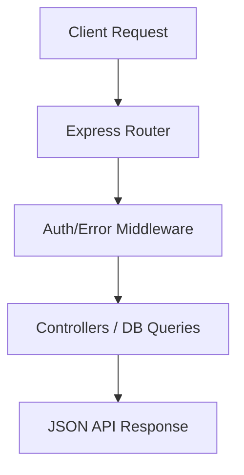
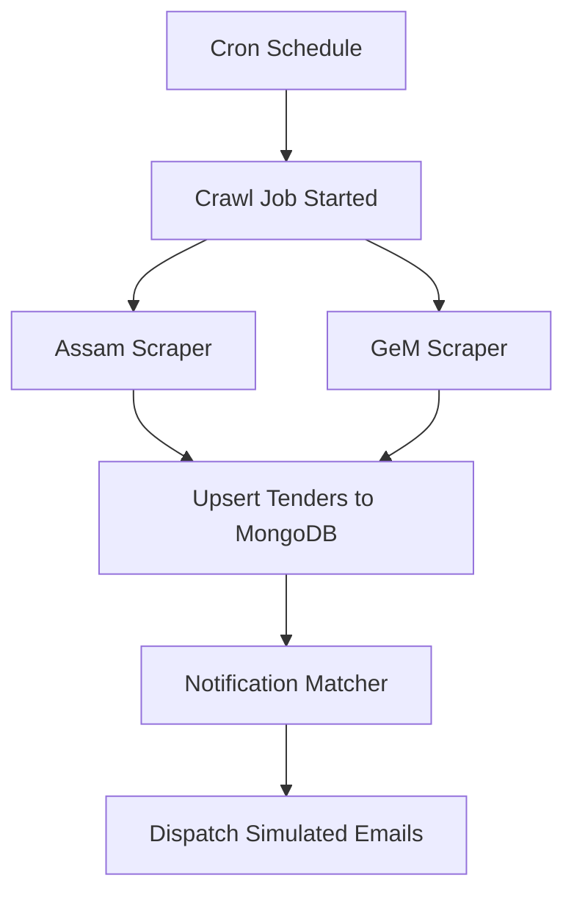

# Tender.ai Backend Service

Tender.ai is a professional backend service designed to scrape, aggregate, search, and notify users about procurement opportunities (tenders) from multiple portals (such as Assam eProcurement and Government e-Marketplace - GeM). 

This repository has been fully organized into a clean, modular, and industrial standard Node.js architecture.

---

## 1. Project Directory Structure

The codebase is organized logically, separating concerns across clean layers of configuration, routing, business logic, schemas, and background services:

```text
├── config/
│   └── db.js                 # MongoDB connection initialization and configuration
├── controllers/
│   ├── authController.js     # User registration, login, and session validation
│   ├── tenderController.js   # Tender searches, advanced filters, details, and crawl triggers
│   └── userController.js     # Watchlist saves/toggles and custom keyword alert preferences
├── middlewares/
│   ├── authMiddleware.js     # JWT Bearer Token validation and role-based authorization
│   └── errorMiddleware.js    # Global centralized JSON API error & 404 endpoint handlers
├── models/
│   ├── Alert.js              # Mongoose schema for user keyword/value alert preferences
│   ├── Tender.js             # Mongoose schema and full-text search index for Tenders
│   └── User.js               # Mongoose schema for users (includes pre-save password hashing)
├── routes/
│   ├── authRoutes.js         # Routes under /api/auth
│   ├── tenderRoutes.js       # Routes under /api/tenders
│   └── userRoutes.js         # Routes under /api/user
├── services/
│   ├── assamTenderScraper.js # Assam Tenders scraping pipeline (Real Crawler / Simulation fallback)
│   ├── gemScraper.js         # GeM Bids scraping pipeline (Apify / Puppeteer fallback / Simulation)
│   ├── mockDataGenerator.js  # Generator for realistic Mock Tenders (development & testing)
│   ├── notificationService.js# Matcher that runs scraped listings against alerts to trigger emails
│   └── scheduler.js          # Background cron worker that orchestrates sequential crawling
├── utils/
│   └── logger.js             # Winston logger for centralized file and console logging
├── tests/
│   └── apiTest.js            # Automated integration tests using MongoMemoryServer
├── old/                      # Legacy archived code (isolated from the running application)
├── .env.example              # Template for environment configurations
├── .gitignore                # Rules for files excluded from Git (ignores node_modules and logs)
├── package.json              # App manifests, dependencies, and scripts
├── POSTMAN_GUIDE.md          # Comprehensive instructions for testing routes in Postman
└── README.md                 # Project architecture and setup guide (this file)
```

---

## 2. System Architecture & Workflows

### A. API Request Lifecycle


1. **Routing**: `server.js` serves as the entry point, registering routes mounted under `/api`.
2. **Middleware**: Incoming requests to private endpoints validate the `Authorization: Bearer <JWT>` header via `authMiddleware.js`.
3. **Controller**: Business logic handles DB interaction using Mongoose models. Errors are sent using `next(error)` to be caught by the global `errorMiddleware.js`.

### B. Background Scraper & Notification Workflow


1. **Scheduling**: A background task scheduler (`services/scheduler.js`) runs a cron job (configured via `SCRAPER_CRON_SCHEDULE`).
2. **Sequential Scraping**: The cron job triggers `runCrawlJob()`, which scrapes Assam eProcurement and GeM BidPlus portals.
   * **Simulation Mode**: Generates mock items.
   * **Real Mode**: Launches Puppeteer/Apify actors to crawl official listings.
3. **Matching & Notification**: Newly crawled items from the last hour are pulled. The `notificationService.js` compares each tender against active `Alert` preferences in the database.
4. **Email Dispatch**: If a tender matches a user's source, category, minimum/maximum value, and keyword preferences, a simulated email alert is generated and dispatched to the user.

---

## 3. Getting Started

### Prerequisites
* **Node.js**: `v18.x` or higher
* **MongoDB**: A running MongoDB instance locally or on Atlas (Optional for running tests, as tests use an in-memory database).

### Installation
1. Clone the repository and navigate into the root directory:
   ```bash
   cd "Tender.ai Backend"
   ```
2. Install dependencies:
   ```bash
   npm install
   ```
3. Set up configuration variables:
   * Duplicate `.env` template or modify the existing `.env` file:
     ```env
     PORT=5000
     MONGODB_URI=mongodb://127.0.0.1:27017/tender-ai
     JWT_SECRET=super_secret_key
     SCRAPER_SIMULATION_MODE=true
     SCRAPER_CRON_SCHEDULE="0 2 * * *"
     ```

### Scripts

* **Run Database Seeder**:
  Populates MongoDB with a test admin user (`rohan@tender.ai` / `password123`), custom alerts, and 20 mock tenders.
  ```bash
  node seed.js
  ```

* **Trigger Crawler Manually**:
  Runs the scraping sequence once immediately from the command line.
  ```bash
  node scrapeNow.js
  ```

* **Start Development Server**:
  Launches the API server on the designated port (Default: `5000`).
  ```bash
  node server.js
  ```

---

## 4. Testing Suite

The repository includes a self-contained integration test suite that **does not require a running MongoDB server** on your local machine.

* **Test command**:
  ```bash
  node tests/apiTest.js
  ```

**How the test suite works:**
1. Starts a temporary database using `mongodb-memory-server` in the background.
2. Connects to the database and seeds it with mock tenders, users, and alert patterns.
3. Spawns the backend Express application process programmatically on port `5001`.
4. Executes HTTP assertions using `axios` for all routes (auth, watchlist, search filters, alert creation, and role-based route guard blocks).
5. Cleans up and kills the test processes automatically.

---

## 5. Postman Testing
For details on how to import and test the API using Postman, refer to the [POSTMAN_GUIDE.md](POSTMAN_GUIDE.md) document at the root of the project.
